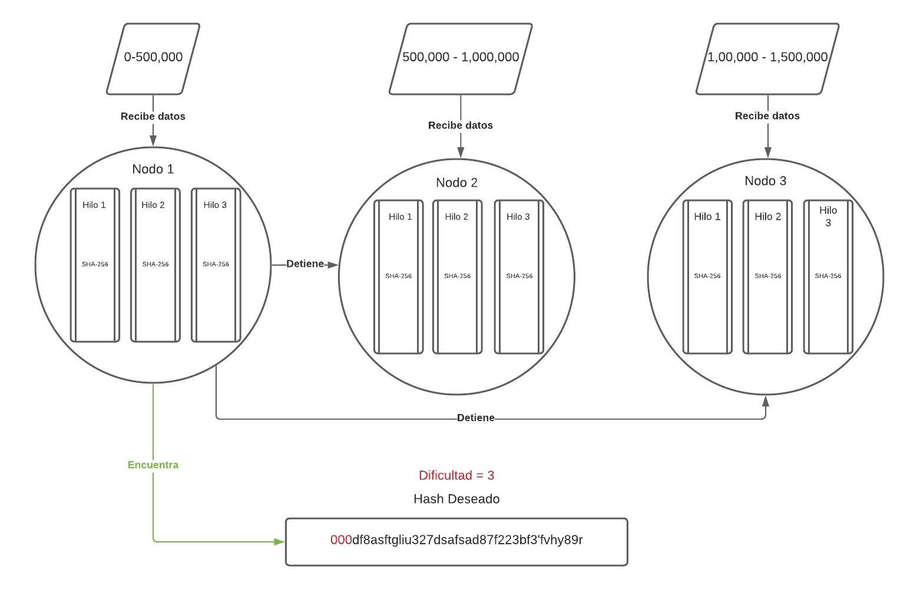

# Simulación de minado de bloques de una cripto moneda
---
#### Materia: *TC2025-Programación Avanzada*

##### Integrantes:
1. Rodrigo Benavente García - A01026973
2. Patricio Tena Zozaya - A01027293


---
## 1. Aspectos generales

Las orientaciones de la tarea se encuentran disponibles en la plataforma **Canvas**.

Este documento es una guía sobre qué información debe entregar como parte del proyecto, qué requerimientos técnicos debe cumplir y la estructura que debe seguir para organizar su entrega.

### 1.1 Requerimientos técnicos

A continuación se mencionan los requerimientos técnicos mínimos del proyecto, favor de tenerlos presente para que cumpla con todos.

* Toda la programación debe realizarse en C.
* La solución al problema debe utilizar el máximo nivel de paralelismo posible, utilizando PThreads u OpenMP y MPI.
* La solución debe ejecutarse en un clúster formado como mínimo por el mismo número de nodos que integrantes tenga el equipo.
* Se debe realizar un análisis de los problemas de concurrencia que se pueden presentar y resolverse de la manera correcta, evitando en todo momento las esperas activas.
* Para resolver los problemas de concurrencia se deben utilizar algunas de las técnicas estudiadas en el semestre.
* Todo el código y la documentación del proyecto debe alojarse en este repositorio de GitHub. Favor de mantener la estructura de carpetas propuesta.
* El código debe estar documentado siguiendo los estándares definidos para el lenguaje de programación C.

### 1.2 Estructura del repositorio

El proyecto debe seguir la siguiente estructura de carpetas:
```
- / 			        # Raíz de todo el proyecto
    - README.md			# Archivo con los datos del proyecto (este archivo)
    - source			# Carpeta con el código fuente de la solución
        - main.c        # Solución en secuencial
        - main2.c       # Solución en paralelo en una sola maquina
        - main3.c.      # Solucion en paralelo en varios nodos
    - docs			    # Carpeta con la documentación del proyecto: PDF, imágenes, etc.
```

### 1.3 Documentación  del proyecto

Como parte de la entrega final del proyecto, se debe incluir la siguiente información:

* Descripción del problema a resolver.
* Análisis exhaustivo de los problemas de concurrencia que se presentan y una explicación clara de cómo se resuelve cada uno de ellos en la solución propuesta.
* Análisis exhauistivo de los inhibidores del paralelismo presentes en el problema planteado y una explicación clara de cómo se resuelve cada uno de ellos en la solución implementada.
* Diagrama con la arquitectura de la solución que incluya: nodos del clúster, componentes de código que se ejecuta en cada nodo, si se hace un *scatter*, *gather*, indicar quien es el nodo maestro y cuáles son los nodos obreros, etc.
* Descripción de cada uno de los componentes de la solución.
* Guía de configuración, compilación y ejecución de la solución implementada y todos los componentes, liberías, etc. que se requieran.

## 2. Descripción del problema

El problema que se resuelve es la implementación del hasheado de una cripto moneda en paralelo. Para esto se utilizo la función de hasheo SHA-256 y una implementación en fuerza bruta para un n número de datos. 

## 3. Solución

A continuación aparecen descritos los diferentes elementos que forman parte de la solución del proyecto.

### 3.1 Análisis de concurrencia
 
Uno de los problemas que encontramos es que cada máquina analizaba los mismos datos, para resover esto cada nodo tenían que dividirse una cierta cantidad de datos y analizar solo ese rango, para asi encontralos de una manera mucho más eficientes.

Otro problema era que al un nodo encontar el hash deseado, tenía que mandar una señal a las demás máquinas para que detuvieran su búsqueda. Para eso utilizamos una variable compartida, que se accesaba dentro de la zona crítica, y asi todos los nodos supieran si es hash ya se había, o no, encontrado.
### 3.2 Análisis de los inhibidores del paralelismo

Un inhibidor que encontramos es que cuando un hilo dentro de un nodo encontraba el hash deseado le tenía que enviar la variable a los otros hilos y nodos para que estos se detuvieran una vez que el hash fuera encontrado.

### 3.3 Arquitectura de la solución


## 4. Pasos a seguir para utilizar el proyecto

### 4.1 Dependencias y requisitos

- OpenMP
#### 4.1.1 Frameworks
No aplica
#### 4.1.2 Librerías de funciones o dependencias
- OpenMP
- Vagrant
- VirtualBox
- Crypt
#### 4.1.3 Guía de uso

1. Instalar [VirtualBox](https://www.virtualbox.org/)
2. Instalar [Vagrant](https://www.vagrantup.com/)
3. Crea una carpeta nombrada mpi-vagrant en tu computadora
4. Descarga a la carpeta mpi-vagrant los archivos [Vagrantfile](docs/Vagrantfile) y [Machines](docs/machines)
5. Abre una Terminal en tu computadora y cámbiate a la carpeta mpi-vagrant
6. Clona el repositorio: 

        git clone https://github.com/tec-csf/tc2025-proyecto-final-equipo_2
7. Inicia el clúster: 
        
        vagrant up
8. Una vez que termine el comando anterior, accede por SSH al nodo 1 con el comando:
        
        vagrant ssh node1
    - Desde el nodo 1, verifica que tienes conectividad al nodo 2 con el comando: ssh node2. La primera vez te preguntará si aceptas que se adicione la llave al archivo de autorización, selecciona que si (Y) y continua.
    - Regresa al nodo 1 con el comando: exit
    - Desde el nodo 1, verifica que tienes conectividad al nodo 3 con el comando: ssh node3. La primera vez te preguntará si aceptas que se adicione la llave al archivo de autorización, selecciona que si (Y) y continua.
    - Regresa al nodo 1 con el comando: exit
9. Una vez dentro del nodo 1:
    - Moverte a la ubicacion del codigo:

            cd /vagrant/tc2025-proyecto-final-equipo_2/

    - Compilar el código:

            mpicc main3.c -lcrypt -fopenmp
    - Correrlo:

            mpirun -np 3 -f /vagrant/machines ./a.out 'd'
        >Donde d es un int de la dificultad del hasheado
10. Para apagar vagrant:

        vagrant halt
    

## 5. Referencias

- https://www.freecodecamp.org/news/how-bitcoin-mining-really-works-38563ec38c87/
- https://www.youtube.com/watch?v=bBC-nXj3Ng4&t=1s
- https://bitcoin.org/bitcoin.pdf
